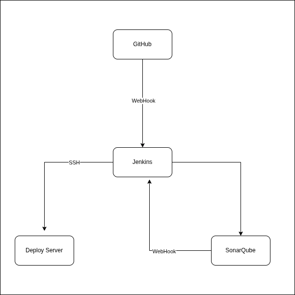

# Project

A comprehensive project on deploying a [blog-app](https://github.com/DevOpsByNavin/Blog-App.git) site through `jenkins` CI/CD pipeline.

## Outcome Workflow

1. Developer commit new changes on github repo
2. It triggers webhook to Jenkins pipeline.
3. Inside pipeline, performs dependency check
4. Perform SonarQube analysis and wait for Quality Gate webhook trigger from SonarQube server to continue next pipeline.
3. It then gonna build three images for `backend1`, `backend2` and `nginx`.
4. Images are then pushed to `Harbor` server with proper tagging.
5. Then it gonna `SSH` to deployment server.
6. Pull latest images from `Harbor`
7. Take down old versioned docker container and spin up latest container from updated images.

## Tools used:

- Jenkins
- Harbor
- SonarQube
- Amazon EC2 or any other public VPS's
- OWASP Dependency Tracker

