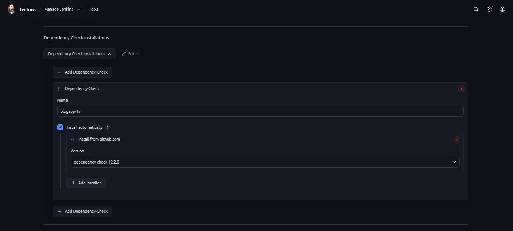
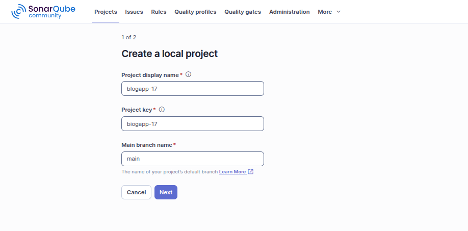
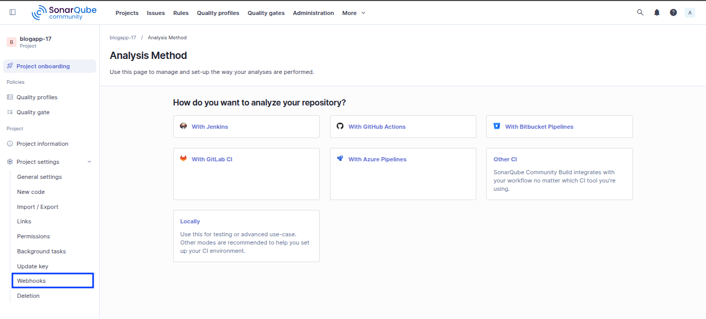
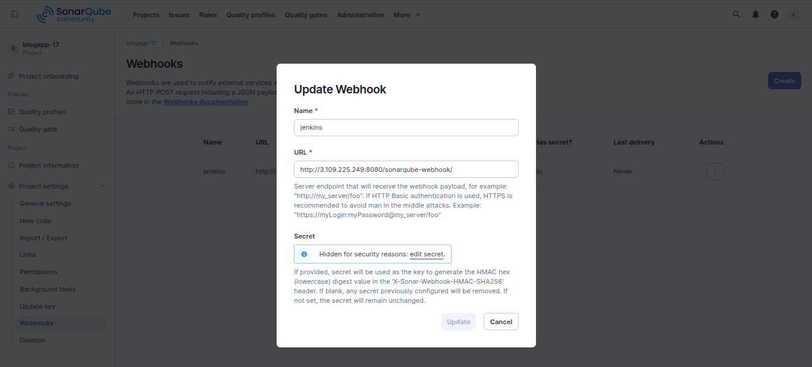
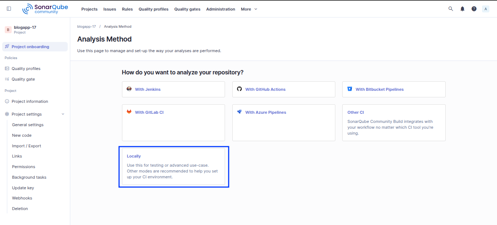
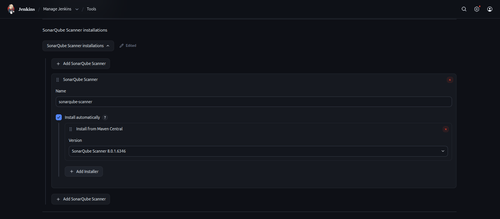
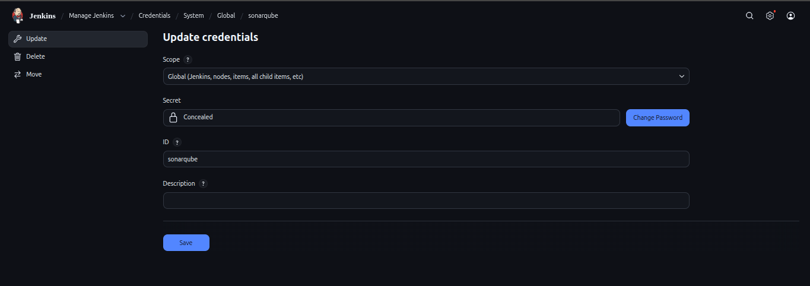
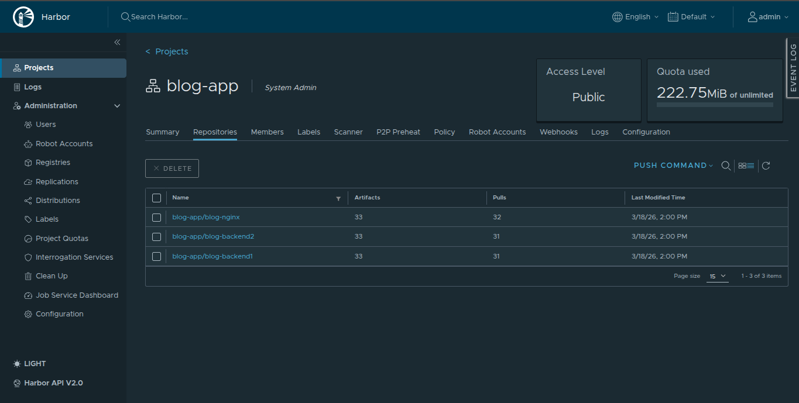
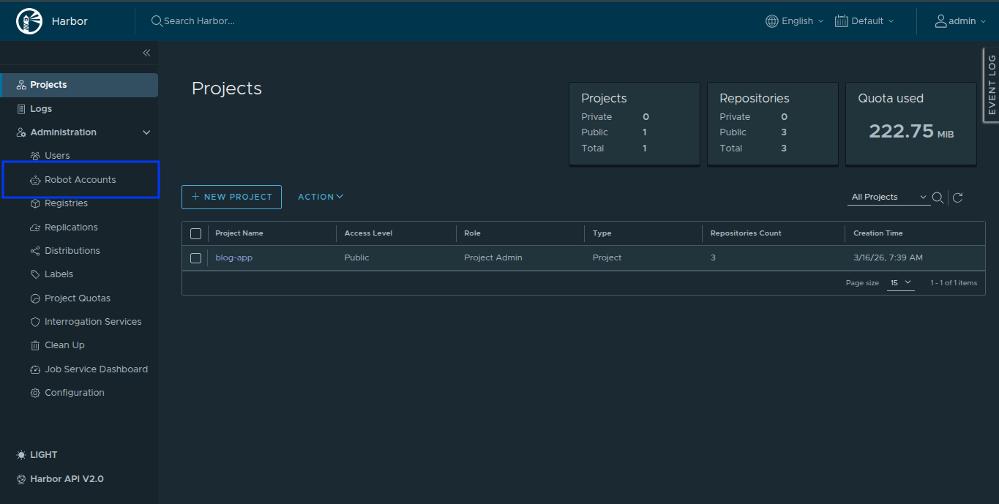
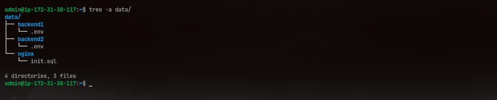

# Project Setup Guide

## 1. Jenkins Installation

Access the [offical docs](https://www.jenkins.io/doc/book/installing/linux/) for Jenkins Installation and setup jenkins on your server.

### 1.1 Essential Plugins

We start by installalling plugins that gonna be helpful later on.

1. On jenkins, `Manage Jenkins` -> `Plugins`
2. Install given plugins and restart your jenkins server.

    - OWASP Dependency-Check Plugin
    - SonarQube Scanner for Jenkins

### 1.2 Additional tools on Jenkins server

In addition to Jenkins we also need other tools installed on the server. Which includes:

- `npm`

    ```bash
    sudo apt update && sudo apt install -y nodejs npm
    ```

- `docker`

    Follow [docker installation guide](https://docs.docker.com/engine/install/debian/) for proper setup.

    > Don't forget to add `jenkins` user to `docker` group.

## 2. Project Setup

If you wanna follow this gudie, start by cloning the repo from [Blog-App](https://github.com/DevOpsByNavin/Blog-App) to your local system.  
We have to make some changes before working with other setups.

### 2.1 Nginx Configuration

Navigate to `infra/nginx` and modfiy `nginx.conf` as per you need.

Here's mine for the reference

```nginx
events { }

http {
    include /etc/nginx/mime.types;

    server {
        listen 80;
        server_name 13.126.240.245;

        root /var/www/blog-app;
        index index.html;

        location / {
            try_files $uri $uri/ /index.html;
        }

        location /api/users {
            proxy_pass http://backend1:3000;
            proxy_http_version 1.1;
            proxy_set_header Host $host;
            proxy_set_header X-Real-IP $remote_addr;
            proxy_set_header X-Forwarded-For $proxy_add_x_forwarded_for;
        }

        location /api/blogs {
            proxy_pass http://backend2:3001;
            proxy_http_version 1.1;
            proxy_set_header Host $host;
            proxy_set_header X-Real-IP $remote_addr;
            proxy_set_header X-Forwarded-For $proxy_add_x_forwarded_for;
        }

        location /api/comments {
            proxy_pass http://backend2:3001;
            proxy_http_version 1.1;
            proxy_set_header Host $host;
            proxy_set_header X-Real-IP $remote_addr;
            proxy_set_header X-Forwarded-For $proxy_add_x_forwarded_for;
        }
    }
}
```
> Note: We are currently not using any `SSL` related configs and also replace `server_name` with ip of your deployment server.

### 2.2 Dokerfile

Create three different `Dockerfile` for two backend and frontend (Nginx).

`infra/nginx/Dockerfile`

```Dockerfile
FROM node:20-alpine AS builder

WORKDIR /app
COPY services/frontend/package.json ./
COPY services/frontend/package-lock.json ./
RUN npm ci --legacy-peer-deps
COPY services/frontend ./
RUN npm run build

FROM nginx:alpine

RUN rm /etc/nginx/conf.d/default.conf
COPY infra/nginx/nginx.conf /etc/nginx/nginx.conf
COPY --from=builder /app/dist /var/www/blog-app
EXPOSE 80
CMD ["nginx", "-g", "daemon off;"]
```

`services/backend1/Dockerfile`

```Dockerfile
FROM node:20-alpine

WORKDIR /app
COPY services/backend1/package.json ./
COPY services/backend1/package-lock.json ./
RUN npm ci 
COPY services/backend1/ .
CMD ["sh", "-c", "npm run migrate && npm start"]
```

`services/backend2/Dockerfile`

```Dockerfile
FROM node:20-alpine

WORKDIR /app
COPY services/backend2/package.json ./
COPY services/backend2/package-lock.json ./
RUN npm ci 
COPY services/backend2/ .
CMD ["sh", "-c", "npm run migrate && npm start"]
```


### 2.3 Dependency Tracker

1. Navigate to `Jenkins -> Manage Jenkins -> Tools`.
2. Find config for `Dependency-Check installations`.
3. Give it a name and install requird tools through given github option.



## 3. SonarQube Setup

We have to configure sonarqube on both jenkins and it's web server.

### 3.1 SonarQube Server Setup

Follow this [docker-compose.yml](https://medium.com/@denis.verkhovsky/sonarqube-with-docker-compose-complete-tutorial-2aaa8d0771d4) file for setting up SonarQube server.

Or, you can simply `C/P` given docker compose file to build sonarqube server.

```docker-compose
services:
  sonarqube:
    image: sonarqube:community
    container_name: sonarqube
    depends_on:
      - db
    ports:
      - "9000:9000"
    environment:
      SONAR_JDBC_URL: jdbc:postgresql://db:5432/sonar
      SONAR_JDBC_USERNAME: sonar
      SONAR_JDBC_PASSWORD: sonar
    volumes:
      - sonarqube_data:/opt/sonarqube/data
      - sonarqube_extensions:/opt/sonarqube/extensions
      - sonarqube_logs:/opt/sonarqube/logs
    restart: unless-stopped 

  db:
    image: postgres:15
    container_name: sonarqube_db
    environment:
      POSTGRES_USER: sonar
      POSTGRES_PASSWORD: sonar
      POSTGRES_DB: sonar
    volumes:
      - postgresql:/var/lib/postgresql/data
    restart: unless-stopped 

volumes:

  sonarqube_data:
  sonarqube_extensions:
  sonarqube_logs:
  postgresql:
```

#### 3.1.1 Project and Webhook

1. Now navigate to `<ip>:<port>` where the sonarqube is running and sigin using default credential.  

    `username`: admin  
    `password`: admin

2. On the dashboard, navigate to `Create Project` -> `Local project`.
3. Give a project name. Note `project-key` will also share the same name.



4. Click on the newly create a project and add Webhook.



5. Hit `Create`, give a name and `Jenkins` server ip.



#### 3.1.2 Generating Token

1. Head over to the project dashboard and navigate to `Locally`



2. Give token a name and click on generate.
3. Note down the token. We will later use to setup sonarqube on jenkins.

### 3.2 SonarQube Jenkins Setup

#### 3.2.1 Global Tool installation

1. Navigate to `Jenkins -> Manage Jenkins -> Tools`.
2. Find config for `SonarQube Sanner installations`.
3. Give it a name and install scanner tools through given `Maven Central` option.



### 3.2.2 SonarQube token credential

1. Find `Manage-Jenkins` -> `Credentials`.
2. Create a new credential of type `Secret text`.
3. Give credential a name and paste previously copied token from SonarQube.



#### 3.2.3 SonarQube server installation

1. Navigate to `Jenkins -> Manage Jenkins -> System`.
2. Find config for `SonarQube servers`.
3. Provide sonarqube server url and select the stored sonarqube token credential.


## 4. Harbor Setup

1. Creaet a new project.
2. Inside the project, create 3 repo for nginx and 2 frontend images.



3. Genrate API to access harbor by navigting to `Administration` -> `Robot Accounts`



> Don't forget to provide project level access to API key.

4. Open Jenkins server and add harbor api key as secret text.

## 5. Deployment server setup

On the deployment server we gonna need to place `.env` file for both `backend1` and `backend2` server.

For that just create a `data` directory with following contents.



> You can create these `.env` file using `.env.example` file from the respective repo.

For `/home/admin/data/postgres/init.sql` file, copy it from `infra/database/init.sql`.

## 6. Jenkinsfile and docker-compose.yml

Find these file at the top of the [repo](https://github.com/DevOpsByNavin/blogapp-17)

Make necessary chagnes as per your need.

> Also add `.dockerignore` file on root repo directory to exclude non-essential file during docker process.